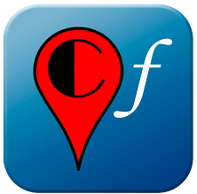

 

  

  <h3 align="center">CultureFinder Backend</h3>

  

    Backend application of the Culture Finder mobile app!
     
     
  

    

## Table Of Contents

* [About the Project](#about-the-project)
* [Built With](#built-with)
* [Getting Started](#getting-started)
  * [Installation](#installation)
* [Usage](#usage)
* [Roadmap](#roadmap)
* [Authors](#authors)
* [Acknowledgements](#acknowledgements)

## About The Project

This is the backend application, made in Java, of our application. Our whole project consists of a mobile application for Android to visualize all the events categorized by the Cultural Agenda (https://agenda.cultura.gencat.cat/content/agenda/ca.html). The goal is to provide an application that allows users to find new events intuitively. It is primarily focused on the residents of Catalonia of all ages.

The application consists of four organization systems for the more than 48,000 entries present in the Cultural Agenda API. In particular, it offers the option to view, save, sort, and filter events based on their location, through an interactive map, or based on their dates/times through a calendar.

It also provides the option to list all current, future, and past events in a list format to facilitate searching through filters.

## Built With

As mentioned before, this backend application is made with Java JDK 17, using the framework Springboot v3.0.4. The database is managed by PostgreSQL v14.7. 

## Getting Started

### Installation

_To know about running the application, please see the [Releasing Information]([https://example.com](https://github.com/ivan-risueno/CultureFinder-Backend/blob/main/docs/Final_Release/CultureFinder_ReleasingInformation.docx.pdf))_

## Roadmap

See the [open issues](https://github.com/ivan-risueno/CultureFinder-Backend/issues) for a list of proposed features (and known issues).

## Authors

* **Iván Risueño Martín** - *Backend Leader* - [Iván Risueño Martín](https://github.com/ivan-risueno/) - *Major features of the project*
* **Daniel Morón Roces** - *Backend Developer* - [Daniel Morón Roces](https://github.com/danielmr6/) - *Major features of the project*

## Acknowledgements

* [Miguel Moreno](https://github.com/MiguelMorenoAlcaraz/)
* [Marc Duch](https://github.com/Marcarrones/)
* [Marc Rodríguez](https://github.com/MarcRd11/)
* [Oscar Delgado](https://github.com/oscard147/)

